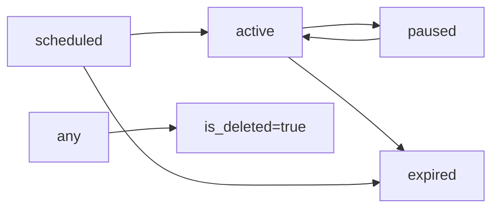

# 📚 DOCUMENTAÇÃO COMPLETA DA API I9 SMART CAMPAIGNS

## 🎯 VISÃO GERAL

A **i9 Smart Campaigns API** é uma API RESTful desenvolvida em FastAPI para gerenciamento de campanhas publicitárias em tablets/totems distribuídos em múltiplos postos. Esta documentação serve como referência completa para equipes que irão desenvolver o portal administrativo e integrar com a API.

## 🔐 INFORMAÇÕES DE ACESSO

### AMBIENTE DE DESENVOLVIMENTO

```yaml
Base URL: http://localhost:8000
API Documentation: http://localhost:8000/docs (Swagger UI)
ReDoc: http://localhost:8000/redoc
```

### CREDENCIAIS PADRÃO

#### PORTAL ADMINISTRATIVO (JWT)
```yaml
Username: admin
Password: admin123
Email: admin@i9smart.com.br
Role: admin
```

#### TABLETS/TOTEMS (API KEY)
```yaml
API Key: i9smart_campaigns_readonly_2025
Header: X-API-Key
```

### BANCO DE DADOS

```yaml
Host: 10.0.10.5
Port: 5432
Database: i9_campaigns
Username: campaigns_user
Password: Camp@2025#Secure
```

## 🔑 AUTENTICAÇÃO

### 1. PORTAL ADMINISTRATIVO - JWT

O portal usa autenticação JWT com Bearer Token. O fluxo é:

1. **Login** → Recebe `access_token` e `refresh_token`
2. **Requisições** → Envia `Bearer {access_token}` no header
3. **Renovação** → Usa `refresh_token` para obter novo `access_token`

#### EXEMPLO DE LOGIN

```bash
curl -X POST "http://localhost:8000/api/auth/login" \
  -H "Content-Type: application/x-www-form-urlencoded" \
  -d "username=admin&password=admin123"
```

**Resposta:**
```json
{
  "access_token": "eyJhbGciOiJIUzI1NiIsInR5cCI6IkpXVCJ9...",
  "refresh_token": "eyJhbGciOiJIUzI1NiIsInR5cCI6IkpXVCJ9...",
  "token_type": "bearer"
}
```

### 2. TABLETS - API KEY

Tablets usam API Key no header para acesso somente leitura:

```bash
curl -X GET "http://localhost:8000/api/tablets/active/001" \
  -H "X-API-Key: i9smart_campaigns_readonly_2025"
```

## 📋 ENDPOINTS DA API

### 🔐 AUTENTICAÇÃO (`/api/auth`)

| Método | Endpoint | Descrição | Autenticação |
|--------|----------|-----------|--------------|
| POST | `/api/auth/login` | Login e obtenção de tokens | Não |
| POST | `/api/auth/refresh` | Renovar access token | Não |
| GET | `/api/auth/me` | Obter perfil do usuário autenticado | JWT |
| PUT | `/api/auth/me` | Atualizar perfil do usuário | JWT |
| PUT | `/api/auth/me/password` | Alterar senha do usuário | JWT |
| DELETE | `/api/auth/me` | Desativar conta (soft delete) | JWT |

### 📢 CAMPANHAS (`/api/campaigns`)

| Método | Endpoint | Descrição | Autenticação | Roles |
|--------|----------|-----------|--------------|-------|
| GET | `/api/campaigns/` | Listar todas campanhas | JWT | todos |
| POST | `/api/campaigns/` | Criar nova campanha | JWT | admin, editor |
| GET | `/api/campaigns/{id}` | Obter campanha específica | JWT | todos |
| PUT | `/api/campaigns/{id}` | Atualizar campanha | JWT | admin, editor |
| DELETE | `/api/campaigns/{id}` | Remover campanha (soft delete) | JWT | admin |
| GET | `/api/campaigns/active` | Todas campanhas ativas (cache) | JWT | todos |
| GET | `/api/campaigns/active/{station_id}` | Campanhas ativas por posto | JWT | todos |

### 🖼️ IMAGENS

| Método | Endpoint | Descrição | Autenticação | Roles |
|--------|----------|-----------|--------------|-------|
| GET | `/api/campaigns/{id}/images` | Listar imagens da campanha | JWT | todos |
| POST | `/api/campaigns/{id}/images` | Upload de múltiplas imagens | JWT | admin, editor |
| PUT | `/api/campaigns/{id}/images/order` | Reordenar imagens | JWT | admin, editor |
| PUT | `/api/images/{id}` | Atualizar propriedades da imagem | JWT | admin, editor |
| DELETE | `/api/images/{id}` | Remover imagem | JWT | admin, editor |

### 📱 TABLETS (`/api/tablets`)

| Método | Endpoint | Descrição | Autenticação |
|--------|----------|-----------|--------------|
| GET | `/api/tablets/active` | Todas campanhas ativas (tablets) | API Key |
| GET | `/api/tablets/active/{station_id}` | Campanhas ativas por estação (tablets) | API Key |

### 🏥 HEALTH CHECK (`/health`)

| Método | Endpoint | Descrição | Autenticação |
|--------|----------|-----------|--------------|
| GET | `/health/` | Status básico do serviço | Não |
| GET | `/health/live` | Liveness probe (K8s) | Não |
| GET | `/health/ready` | Readiness probe (K8s) | Não |
| GET | `/health/detailed` | Status detalhado de todos componentes | JWT (opcional) |

### 📊 MÉTRICAS (`/api/metrics`)

| Método | Endpoint | Descrição | Autenticação | Roles |
|--------|----------|-----------|--------------|-------|
| GET | `/api/metrics/dashboard` | Métricas gerais do dashboard | JWT | todos |
| GET | `/api/metrics/campaigns/{id}` | Métricas de campanha específica | JWT | todos |
| GET | `/api/metrics/stations` | Métricas por estação | JWT | todos |
| GET | `/api/metrics/activity` | Atividade dos últimos N dias | JWT | todos |
| GET | `/api/metrics/activity/detailed` | Atividade detalhada com usuários | JWT | todos |
| GET | `/api/metrics/views` | Visualizações totais estimadas | JWT | todos |
| GET | `/api/metrics/views/{period}` | Visualizações por período (today/week/month) | JWT | todos |
| GET | `/api/metrics/system` | Métricas do sistema (CPU, memória) | JWT | admin |

### 🔄 ATIVIDADES (`/api/activity`)

| Método | Endpoint | Descrição | Autenticação | Roles |
|--------|----------|-----------|--------------|-------|
| GET | `/api/activity/feed` | Feed de atividades do sistema | JWT | todos |
| GET | `/api/activity/audit/summary` | Resumo de auditoria | JWT | admin |

### 🏢 FILIAIS (`/api/branches`)

| Método | Endpoint | Descrição | Autenticação | Roles |
|--------|----------|-----------|--------------|-------|
| GET | `/api/branches` | Listar todas as filiais | JWT | todos |
| GET | `/api/branches/{id}` | Detalhes da filial com estações | JWT | todos |
| GET | `/api/branches/by-code/{code}` | Buscar filial por código | JWT | todos |
| GET | `/api/branches/active` | Listar filiais ativas | JWT | todos |
| GET | `/api/branches/regions` | Listar regiões e estados | JWT | todos |
| POST | `/api/branches` | Criar nova filial | JWT | admin |
| PUT | `/api/branches/{id}` | Atualizar filial | JWT | admin |
| DELETE | `/api/branches/{id}` | Desativar filial | JWT | admin |
| GET | `/api/branches/{id}/statistics` | Estatísticas da filial | JWT | todos |

### 🏪 ESTAÇÕES (`/api/stations`)

| Método | Endpoint | Descrição | Autenticação | Roles |
|--------|----------|-----------|--------------|-------|
| GET | `/api/stations` | Listar todas as estações | JWT | todos |
| GET | `/api/stations/{id}` | Detalhes da estação | JWT | todos |
| GET | `/api/stations/active` | Listar estações ativas | JWT | todos |
| GET | `/api/stations/by-branch-and-code/{branch_code}/{station_code}` | Buscar por filial e código | JWT | todos |
| GET | `/api/branches/{branch_id}/stations` | Estações de uma filial | JWT | todos |
| GET | `/api/stations/available` | Estrutura completa filiais/estações | JWT | todos |
| POST | `/api/stations` | Criar nova estação | JWT | admin |
| PUT | `/api/stations/{id}` | Atualizar estação | JWT | admin |
| DELETE | `/api/stations/{id}` | Desativar estação | JWT | admin |

## 📊 MODELOS DE DADOS

### Campaign

```typescript
interface Campaign {
  id: string;                    // UUID
  name: string;                  // Nome da campanha
  description?: string;          // Descrição opcional
  status: 'active' | 'scheduled' | 'paused' | 'expired';
  start_date: DateTime;          // Data/hora início
  end_date: DateTime;            // Data/hora fim
  default_display_time: number;  // Tempo em ms (padrão: 5000)
  stations: string[];            // IDs dos postos ["001", "002"] ou [] para global
  priority: number;              // 0-100 (maior = mais importante)
  is_deleted: boolean;           // Soft delete
  created_at: DateTime;
  updated_at: DateTime;
  created_by?: string;           // UUID do usuário
}
```

#### 📌 Estações - Global vs Específicas

- **Campanha Global**: `stations: []` (array vazio) - Aparece para TODAS as estações
- **Campanha Específica**: `stations: ["001", "002"]` - Aparece APENAS para essas estações

### CampaignImage

```typescript
interface CampaignImage {
  id: string;                    // UUID
  campaign_id: string;           // UUID da campanha
  filename: string;              // Nome do arquivo no storage
  original_filename?: string;    // Nome original do upload
  url: string;                   // URL completa da imagem
  order: number;                 // Ordem de exibição (0, 1, 2...)
  display_time?: number;         // Override do tempo (ms)
  title?: string;                // Título opcional
  description?: string;          // Descrição opcional
  active: boolean;               // Se está ativa
  size_bytes?: number;           // Tamanho em bytes
  mime_type?: string;            // image/jpeg, image/png
  width?: number;                // Largura em pixels
  height?: number;               // Altura em pixels
  created_at: DateTime;
  updated_at: DateTime;
}
```

### User

```typescript
interface User {
  id: string;                    // UUID
  email: string;                 // Email único
  username: string;              // Username único
  full_name?: string;            // Nome completo
  role: 'admin' | 'editor' | 'viewer';
  is_active: boolean;
  is_verified: boolean;
  created_at: DateTime;
  updated_at: DateTime;
}
```

### UserProfile (Response do /me)

```typescript
interface UserProfile {
  id: string;
  email: string;
  username: string;
  full_name?: string;
  role: string;
  is_active: boolean;
  is_verified: boolean;
  created_at: DateTime;
  updated_at: DateTime;
}
```

## 🚀 Exemplos de Uso

### 1. Fluxo Completo - Portal Admin

```javascript
// 1. Login
const loginResponse = await fetch('http://localhost:8000/api/auth/login', {
  method: 'POST',
  headers: { 'Content-Type': 'application/x-www-form-urlencoded' },
  body: 'username=admin&password=admin123'
});
const { access_token } = await loginResponse.json();

// 2. Criar Campanha (Exemplo: Regional)
const campaign = await fetch('http://localhost:8000/api/campaigns/', {
  method: 'POST',
  headers: {
    'Authorization': `Bearer ${access_token}`,
    'Content-Type': 'application/json'
  },
  body: JSON.stringify({
    name: 'Promoção de Verão',
    description: 'Ofertas especiais de verão',
    status: 'active',
    start_date: '2025-01-22T00:00:00Z',
    end_date: '2025-03-22T23:59:59Z',
    default_display_time: 5000,
    stations: ['001', '002', '003'], // Específica para essas estações
    priority: 10
  })
});
const campaignData = await campaign.json();

// 2.1. Criar Campanha Global (todas as estações)
const globalCampaign = await fetch('http://localhost:8000/api/campaigns/', {
  method: 'POST',
  headers: {
    'Authorization': `Bearer ${access_token}`,
    'Content-Type': 'application/json'
  },
  body: JSON.stringify({
    name: 'Black Friday 2025',
    description: 'Promoção válida em toda a rede',
    status: 'active',
    start_date: '2025-11-01T00:00:00Z',
    end_date: '2025-11-30T23:59:59Z',
    default_display_time: 5000,
    stations: [], // Array vazio = campanha global
    priority: 15
  })
});

// 3. Upload de Imagens
const formData = new FormData();
formData.append('files', imageFile1);
formData.append('files', imageFile2);
formData.append('files', imageFile3); // Até 20 imagens por vez

const imagesResponse = await fetch(
  `http://localhost:8000/api/campaigns/${campaignData.id}/images`,
  {
    method: 'POST',
    headers: { 'Authorization': `Bearer ${access_token}` },
    body: formData
  }
);

// Resposta do upload:
const uploadedImages = await imagesResponse.json();
/*
{
  "images": [
    {
      "id": "uuid-1",
      "campaign_id": "campaign-uuid",
      "filename": "campaign_uuid_image1.jpg",
      "original_filename": "banner-promo.jpg",
      "url": "http://storage.local/campaigns/campaign_uuid_image1.jpg",
      "order": 0,
      "display_time": 5000,
      "size_bytes": 250000,
      "mime_type": "image/jpeg",
      "width": 1920,
      "height": 1080
    },
    // ... mais imagens
  ],
  "total": 3,
  "message": "3 imagens enviadas com sucesso"
}
*/

// 4. Listar Imagens da Campanha
const campaignImages = await fetch(
  `http://localhost:8000/api/campaigns/${campaignData.id}/images`,
  {
    headers: { 'Authorization': `Bearer ${access_token}` }
  }
);

// 5. Reordenar Imagens
await fetch(
  `http://localhost:8000/api/campaigns/${campaignData.id}/images/order`,
  {
    method: 'PUT',
    headers: {
      'Authorization': `Bearer ${access_token}`,
      'Content-Type': 'application/json'
    },
    body: JSON.stringify({
      order: [imageId3, imageId1, imageId2] // Nova ordem por IDs
    })
  }
);

// 6. Atualizar Display Time de uma Imagem
await fetch(
  `http://localhost:8000/api/images/${imageId1}`,
  {
    method: 'PUT',
    headers: {
      'Authorization': `Bearer ${access_token}`,
      'Content-Type': 'application/json'
    },
    body: JSON.stringify({
      display_time: 8000, // 8 segundos
      title: "Promoção Principal",
      active: true
    })
  }
);

// 7. Remover Imagem
await fetch(
  `http://localhost:8000/api/images/${imageId2}`,
  {
    method: 'DELETE',
    headers: { 'Authorization': `Bearer ${access_token}` }
  }
);
```

### 2. Fluxo Tablet - Buscar Campanhas

```javascript
// Tablet busca campanhas ativas para o posto 001
const response = await fetch('http://localhost:8000/api/tablets/active/001', {
  headers: { 'X-API-Key': 'i9smart_campaigns_readonly_2025' }
});

const data = await response.json();
/*
Resposta:
{
  "station_id": "001",
  "campaigns": [
    {
      "id": "123e4567-e89b-12d3-a456-426614174000",
      "name": "Promoção de Verão",
      "description": "Ofertas especiais",
      "default_display_time": 5000,
      "images": [...] // Se implementado
    }
  ],
  "timestamp": "2025-01-22T10:30:00Z"
}
*/
```

### 3. Renovação de Token

```javascript
// Quando access_token expirar
const refreshResponse = await fetch('http://localhost:8000/api/auth/refresh', {
  method: 'POST',
  headers: { 'Content-Type': 'application/json' },
  body: JSON.stringify({ refresh_token: savedRefreshToken })
});

const { access_token: newToken } = await refreshResponse.json();
```

### 4. Perfil do Usuário

```javascript
// Obter perfil do usuário autenticado
const profileResponse = await fetch('http://localhost:8000/api/auth/me', {
  headers: { 'Authorization': `Bearer ${access_token}` }
});
const profile = await profileResponse.json();

// Alterar senha
await fetch('http://localhost:8000/api/auth/me/password', {
  method: 'PUT',
  headers: {
    'Authorization': `Bearer ${access_token}`,
    'Content-Type': 'application/json'
  },
  body: JSON.stringify({
    current_password: 'senha_atual',
    new_password: 'nova_senha_segura'
  })
});
```

### 5. Métricas e Monitoramento

```javascript
// Dashboard com métricas gerais
const metricsResponse = await fetch('http://localhost:8000/api/metrics/dashboard', {
  headers: { 'Authorization': `Bearer ${access_token}` }
});
const metrics = await metricsResponse.json();
/*
{
  "overview": {
    "total_campaigns": 10,
    "total_active": 4,
    "total_images": 45,
    "total_users": 3
  },
  "campaigns_by_type": {
    "global": 6,
    "specific": 4
  },
  "recent_activity": {
    "last_7_days": 2,
    "last_30_days": 10
  }
}
*/

// Visualizações estimadas
const viewsResponse = await fetch('http://localhost:8000/api/metrics/views', {
  headers: { 'Authorization': `Bearer ${access_token}` }
});
const views = await viewsResponse.json();
/*
{
  "timestamp": "2025-01-24T10:30:00Z",
  "views": {
    "total_today": 24300,
    "total_this_hour": 1012,
    "total_last_7_days": 170100,
    "average_per_hour": 1012,
    "active_campaigns": 4
  }
}
*/

// Visualizações detalhadas por período
const viewsTodayResponse = await fetch('http://localhost:8000/api/metrics/views/today', {
  headers: { 'Authorization': `Bearer ${access_token}` }
});
const viewsToday = await viewsTodayResponse.json();
/*
{
  "period": "today",
  "views": {
    "total": 12904,
    "by_hour": [...], // Distribuição por hora
    "by_campaign": [...], // Top campanhas
    "by_station": [...] // Top estações
  }
}
*/

// Feed de atividades do sistema
const activityResponse = await fetch('http://localhost:8000/api/activity/feed', {
  headers: { 'Authorization': `Bearer ${access_token}` }
});
const activity = await activityResponse.json();
/*
{
  "activities": [
    {
      "id": "campaign_created_1758684448.435987",
      "type": "campaign_created",
      "title": "Nova campanha 'Promoção São Paulo' criada",
      "description": "Campanha com prioridade 5 para 3 estações",
      "user": {
        "id": "user-uuid",
        "username": "admin",
        "full_name": "Administrador"
      },
      "metadata": { "campaign_id": "...", "status": "active" },
      "timestamp": "2025-01-24T00:27:28Z"
    }
  ],
  "pagination": { "page": 1, "total": 19 }
}
*/

// Resumo de auditoria (apenas admins)
const auditResponse = await fetch('http://localhost:8000/api/activity/audit/summary', {
  headers: { 'Authorization': `Bearer ${access_token}` }
});
const audit = await auditResponse.json();
/*
{
  "period": { "start": "2025-01-17T10:30:00Z", "end": "2025-01-24T10:30:00Z" },
  "summary": {
    "campaigns_created": 4,
    "campaigns_updated": 0,
    "campaigns_deleted": 0,
    "images_uploaded": 14,
    "active_users": 1,
    "total_activities": 18
  }
}
*/

// Health check para monitoramento
const healthResponse = await fetch('http://localhost:8000/health/detailed');
const health = await healthResponse.json();
/*
{
  "status": "healthy",
  "components": {
    "database": { "status": "healthy", "latency_ms": 15 },
    "redis": { "status": "healthy", "latency_ms": 5 },
    "storage": { "status": "healthy" },
    "system": { "cpu": { "usage_percent": 25 }, "memory": { "usage_percent": 45 } }
  }
}
*/
```

## 🛡️ Roles e Permissões

### Roles Disponíveis

| Role | Descrição | Permissões |
|------|-----------|------------|
| `admin` | Administrador total | Todas as operações |
| `editor` | Editor de conteúdo | Criar/editar campanhas e imagens |
| `viewer` | Visualizador | Apenas leitura |

### Matriz de Permissões

| Operação | Admin | Editor | Viewer | Tablet (API Key) |
|----------|-------|--------|--------|------------------|
| Listar campanhas | ✅ | ✅ | ✅ | ❌ |
| Criar campanha | ✅ | ✅ | ❌ | ❌ |
| Editar campanha | ✅ | ✅ | ❌ | ❌ |
| Deletar campanha | ✅ | ❌ | ❌ | ❌ |
| Upload imagens | ✅ | ✅ | ❌ | ❌ |
| Campanhas ativas | ✅ | ✅ | ✅ | ✅ (read-only) |
| Ver perfil próprio | ✅ | ✅ | ✅ | ❌ |
| Alterar senha | ✅ | ✅ | ✅ | ❌ |
| Ver métricas | ✅ | ✅ | ✅ | ❌ |
| Métricas sistema | ✅ | ❌ | ❌ | ❌ |

## ⚠️ Regras de Negócio

### Campanhas

1. **Datas**: `end_date` deve ser sempre maior que `start_date`
2. **Status automático**: Campanhas expiradas mudam para `expired` automaticamente
3. **Soft delete**: DELETE não remove do banco, apenas marca `is_deleted = true`
4. **Prioridade**: Valores de 0-100, onde 100 é máxima prioridade
5. **Estações**: Array de strings com IDs dos postos

### Imagens

#### Especificações Técnicas
1. **Formatos aceitos**: JPG, JPEG, PNG, WEBP
2. **Tamanho máximo**: 10MB por arquivo
3. **Resolução recomendada**: 1920x1080 (Full HD)
4. **Upload múltiplo**: Até 20 imagens por requisição
5. **Storage**: MinIO/S3 com URLs públicas

#### Ordenação e Display
1. **Ordenação**:
   - Sequencial sem gaps (0, 1, 2, 3...)
   - Automática ao fazer upload
   - Reordenável via endpoint específico
2. **Display time**:
   - Mínimo: 1000ms (1 segundo)
   - Máximo: 60000ms (60 segundos)
   - Padrão: 5000ms (5 segundos)
   - Individual por imagem (override do padrão da campanha)

#### Fluxo de Gerenciamento
1. **Upload** → Imagens são automaticamente ordenadas
2. **Listagem** → Retorna imagens ordenadas com URLs completas
3. **Reordenação** → Envia array de IDs na nova ordem
4. **Atualização** → Modifica display_time, título, ativo/inativo
5. **Remoção** → Delete físico da imagem e reordenação automática

### Cache

- Campanhas ativas: Cache de 2 minutos
- Invalidação automática ao criar/editar/deletar campanhas

## 🔄 Status HTTP

### Sucessos
- `200 OK`: Requisição bem-sucedida
- `201 Created`: Recurso criado com sucesso
- `204 No Content`: Operação sem retorno (delete)

### Erros Cliente
- `400 Bad Request`: Dados inválidos
- `401 Unauthorized`: Não autenticado
- `403 Forbidden`: Sem permissão
- `404 Not Found`: Recurso não encontrado
- `422 Unprocessable Entity`: Validação falhou

### Erros Servidor
- `500 Internal Server Error`: Erro interno
- `503 Service Unavailable`: Serviço indisponível

## 📝 Validações

### Campanha
```json
{
  "name": "string, required, max 255 chars",
  "description": "string, optional, max 1000 chars",
  "status": "enum: active|scheduled|paused|expired",
  "start_date": "ISO 8601 datetime, required",
  "end_date": "ISO 8601 datetime, required, > start_date",
  "default_display_time": "integer, 1000-60000, default 5000",
  "stations": "array of strings, min 1 item",
  "priority": "integer, 0-100, default 0"
}
```

## 🧪 Testando a API

### Usando cURL

```bash
# 1. Login
TOKEN=$(curl -s -X POST "http://localhost:8000/api/auth/login" \
  -H "Content-Type: application/x-www-form-urlencoded" \
  -d "username=admin&password=admin123" \
  | jq -r '.access_token')

# 2. Listar campanhas
curl -X GET "http://localhost:8000/api/campaigns/" \
  -H "Authorization: Bearer $TOKEN"

# 3. Tablet - Campanhas ativas
curl -X GET "http://localhost:8000/api/tablets/active/001" \
  -H "X-API-Key: i9smart_campaigns_readonly_2025"

# 4. Health Check
curl -X GET "http://localhost:8000/health/"

# 5. Métricas Dashboard
curl -X GET "http://localhost:8000/api/metrics/dashboard" \
  -H "Authorization: Bearer $TOKEN"

# 6. Visualizações totais
curl -X GET "http://localhost:8000/api/metrics/views" \
  -H "Authorization: Bearer $TOKEN"

# 7. Visualizações de hoje
curl -X GET "http://localhost:8000/api/metrics/views/today" \
  -H "Authorization: Bearer $TOKEN"

# 8. Feed de atividades
curl -X GET "http://localhost:8000/api/activity/feed" \
  -H "Authorization: Bearer $TOKEN"

# 9. Resumo de auditoria (admin apenas)
curl -X GET "http://localhost:8000/api/activity/audit/summary" \
  -H "Authorization: Bearer $TOKEN"

# 10. Perfil do Usuário
curl -X GET "http://localhost:8000/api/auth/me" \
  -H "Authorization: Bearer $TOKEN"
```

### Usando Postman

1. Importe a collection do OpenAPI: `http://localhost:8000/openapi.json`
2. Configure variáveis de ambiente:
   - `baseUrl`: `http://localhost:8000`
   - `accessToken`: (obtido após login)
   - `apiKey`: `i9smart_campaigns_readonly_2025`

### Usando REST Client (VS Code)

Use o arquivo `/tests/rest/rest.http` incluído no projeto com exemplos completos.

## 🚦 Fluxo de Estados - Campanha



## 🔗 Integrações

### MinIO/S3
- Storage de imagens
- URLs públicas geradas automaticamente
- Bucket: `campaigns`

### Redis
- Cache de campanhas ativas
- TTL: 120 segundos
- Invalidação automática

### PostgreSQL
- Banco principal
- Pool de conexões: 20-60
- Transações ACID

## 📱 Considerações para o Portal

### Frontend Recomendado
- **Framework**: React, Vue ou Angular
- **UI Library**: Material-UI, Ant Design ou Tailwind
- **Estado**: Redux, Zustand ou Pinia
- **HTTP Client**: Axios ou Fetch API

### Features Essenciais
1. **Dashboard**: Visão geral das campanhas com métricas em tempo real
2. **CRUD Campanhas**: Criar, editar, visualizar, deletar
3. **Upload de Imagens**: Drag & drop, preview, reordenação
4. **Calendário**: Visualização de agendamentos
5. **Relatórios**: Estatísticas e analytics
6. **Gestão de Usuários**: CRUD de usuários (se admin)
7. **Monitoramento**: Health checks e métricas do sistema
8. **Perfil**: Visualização e edição do perfil próprio

### Boas Práticas
1. **Interceptor HTTP**: Para adicionar token automaticamente
2. **Refresh Token**: Renovação automática antes de expirar
3. **Loading States**: Feedback visual durante requisições
4. **Error Handling**: Tratamento consistente de erros
5. **Validação**: Validar no frontend antes de enviar
6. **Responsivo**: Funcionar em desktop e mobile

## 🔒 Segurança

### Headers Recomendados
```javascript
{
  'Content-Type': 'application/json',
  'Authorization': 'Bearer {token}',
  'X-Request-ID': 'uuid', // Para tracking
  'Accept-Language': 'pt-BR'
}
```

### Boas Práticas
1. **HTTPS em produção**: Sempre use SSL/TLS
2. **Tokens seguros**: Armazene em httpOnly cookies ou sessionStorage
3. **CORS configurado**: Apenas origens autorizadas
4. **Rate Limiting**: 1000 req/min por API Key
5. **Sanitização**: Sempre sanitize inputs do usuário

## 📞 Suporte e Contato

- **Projeto**: i9 Smart Campaigns
- **Versão API**: 1.0.0
- **Documentação Swagger**: `/docs`
- **ReDoc**: `/redoc`
- **OpenAPI Schema**: `/openapi.json`

---

**Última atualização**: 24/09/2025
**Status**: API em desenvolvimento ativo
**Features implementadas**: Health checks, métricas completas, perfil de usuário, campanhas globais/específicas, visualizações estimadas, feed de atividades, auditoria
**Próximas features**: Websockets, notificações push, analytics avançado

## 🎉 Novidades da Versão Atual

### ✅ Implementado - Dashboard Support

- **Endpoints de Visualizações**: Estimativas de visualizações baseadas em campanhas ativas
  - `/api/metrics/views` - Visualizações totais
  - `/api/metrics/views/{period}` - Por período (today/week/month)

- **Feed de Atividades**: Histórico completo de ações do sistema
  - `/api/activity/feed` - Feed paginado com detalhes de usuário
  - `/api/activity/audit/summary` - Resumo para auditoria (admin)

- **Métricas Detalhadas**: Informações aprimoradas sobre atividades
  - `/api/metrics/activity/detailed` - Atividades com metadados de usuário
