# 🔌 REGRAS DE INTEGRAÇÃO COM API - OBRIGATÓRIO

## 🚫 PROIBIÇÕES ABSOLUTAS

### NUNCA FAZER:
```typescript
// ❌ NUNCA usar dados mockados
const campaigns = [
  { id: 1, name: "Campanha Teste" },  // ❌ PROIBIDO
  { id: 2, name: "Exemplo" }          // ❌ PROIBIDO
]

// ❌ NUNCA hardcode dados
const users = mockUsers  // ❌ PROIBIDO

// ❌ NUNCA simular respostas
return Promise.resolve({ data: fakeData }) // ❌ PROIBIDO
```

## ✅ FLUXO OBRIGATÓRIO DE DESENVOLVIMENTO

### 1. Antes de Codificar - SEMPRE:

```bash
# 1. Localizar documentação da API
ls docs/api/
cat docs/api/README.md

# 2. Identificar base URL da API
cat .env.example
# VITE_API_URL=http://localhost:8000

# 3. Testar endpoint ANTES de implementar
curl -X GET http://localhost:8000/api/campaigns
curl -X GET http://localhost:8000/api/campaigns/1
curl -X POST http://localhost:8000/api/campaigns -d '{"name":"Test"}'

# 4. Documentar estrutura de resposta
```

### 2. Padrão de Service - OBRIGATÓRIO:

```typescript
// services/campaigns.service.ts
import { Campaign, CreateCampaignDTO } from '@/types/campaign'

class CampaignsService {
  private baseURL = import.meta.env.VITE_API_URL || 'http://localhost:8000'
  
  // SEMPRE testar este endpoint antes de implementar
  async getAll(): Promise<Campaign[]> {
    const response = await fetch(`${this.baseURL}/api/campaigns`, {
      headers: {
        'Content-Type': 'application/json',
        'Authorization': `Bearer ${getToken()}` // se necessário
      }
    })
    
    if (!response.ok) {
      throw new Error(`API Error: ${response.status}`)
    }
    
    return response.json()
  }
  
  // SEMPRE validar estrutura antes de usar
  async getById(id: string): Promise<Campaign> {
    const response = await fetch(`${this.baseURL}/api/campaigns/${id}`)
    
    if (!response.ok) {
      throw new Error(`Campaign not found: ${id}`)
    }
    
    return response.json()
  }
  
  // SEMPRE testar criação com dados reais
  async create(data: CreateCampaignDTO): Promise<Campaign> {
    const response = await fetch(`${this.baseURL}/api/campaigns`, {
      method: 'POST',
      headers: {
        'Content-Type': 'application/json',
      },
      body: JSON.stringify(data)
    })
    
    if (!response.ok) {
      const error = await response.json()
      throw new Error(error.message || 'Failed to create campaign')
    }
    
    return response.json()
  }
  
  // SEMPRE implementar update
  async update(id: string, data: Partial<Campaign>): Promise<Campaign> {
    const response = await fetch(`${this.baseURL}/api/campaigns/${id}`, {
      method: 'PUT',
      headers: {
        'Content-Type': 'application/json',
      },
      body: JSON.stringify(data)
    })
    
    if (!response.ok) {
      throw new Error(`Failed to update campaign: ${id}`)
    }
    
    return response.json()
  }
  
  // SEMPRE implementar delete
  async delete(id: string): Promise<void> {
    const response = await fetch(`${this.baseURL}/api/campaigns/${id}`, {
      method: 'DELETE'
    })
    
    if (!response.ok) {
      throw new Error(`Failed to delete campaign: ${id}`)
    }
  }
}

export const campaignsService = new CampaignsService()
```

### 3. Uso com React Query - OBRIGATÓRIO:

```typescript
// pages/campaigns/index.tsx
import { useQuery, useMutation, useQueryClient } from '@tanstack/react-query'
import { campaignsService } from '@/services/campaigns.service'

export function CampaignsPage() {
  const queryClient = useQueryClient()
  
  // SEMPRE usar React Query para fetch
  const { data, isLoading, error } = useQuery({
    queryKey: ['campaigns'],
    queryFn: campaignsService.getAll,
    staleTime: 5 * 60 * 1000, // 5 minutos
    retry: 3, // tentar 3 vezes em caso de erro
  })
  
  // SEMPRE implementar mutations
  const createMutation = useMutation({
    mutationFn: campaignsService.create,
    onSuccess: () => {
      queryClient.invalidateQueries(['campaigns'])
      toast.success('Campanha criada com sucesso!')
    },
    onError: (error) => {
      toast.error(`Erro: ${error.message}`)
    }
  })
  
  // SEMPRE tratar estados
  if (isLoading) return <LoadingSpinner />
  if (error) return <ErrorMessage error={error} />
  if (!data || data.length === 0) return <EmptyState />
  
  // NUNCA renderizar sem dados reais
  return (
    <div>
      {data.map(campaign => (
        <CampaignCard key={campaign.id} campaign={campaign} />
      ))}
    </div>
  )
}
```

## 🧪 CHECKLIST DE TESTE DE API

### Antes de Implementar Qualquer Feature:

```bash
# 1. API está rodando?
curl http://localhost:8000/health

# 2. Endpoint existe?
curl http://localhost:8000/api/campaigns

# 3. Autenticação necessária?
curl -H "Authorization: Bearer TOKEN" http://localhost:8000/api/campaigns

# 4. Estrutura de resposta?
curl http://localhost:8000/api/campaigns | jq

# 5. Paginação?
curl "http://localhost:8000/api/campaigns?page=1&limit=10"

# 6. Filtros funcionam?
curl "http://localhost:8000/api/campaigns?status=active"

# 7. Criar funciona?
curl -X POST http://localhost:8000/api/campaigns \
  -H "Content-Type: application/json" \
  -d '{"name":"Test Campaign"}'

# 8. Update funciona?
curl -X PUT http://localhost:8000/api/campaigns/1 \
  -H "Content-Type: application/json" \
  -d '{"name":"Updated"}'

# 9. Delete funciona?
curl -X DELETE http://localhost:8000/api/campaigns/1
```

## 📝 DOCUMENTAÇÃO DE TIPOS

### SEMPRE definir tipos baseados na API:

```typescript
// types/campaign.ts

// Baseado na resposta real da API
export interface Campaign {
  id: string
  name: string
  description?: string
  status: 'active' | 'paused' | 'completed'
  startDate: string // ISO 8601
  endDate?: string
  budget: number
  spent: number
  createdAt: string
  updatedAt: string
}

// DTOs para criação/update
export interface CreateCampaignDTO {
  name: string
  description?: string
  startDate: string
  endDate?: string
  budget: number
}

export interface UpdateCampaignDTO extends Partial<CreateCampaignDTO> {
  status?: Campaign['status']
}

// Resposta paginada
export interface PaginatedResponse<T> {
  data: T[]
  total: number
  page: number
  limit: number
  totalPages: number
}
```

## 🔧 CONFIGURAÇÃO DE AMBIENTE

### 1. Arquivo .env (OBRIGATÓRIO):

```env
# API Configuration
VITE_API_URL=http://localhost:8000
VITE_API_TIMEOUT=30000
VITE_API_VERSION=v1

# Authentication
VITE_AUTH_ENDPOINT=/api/auth/login
VITE_TOKEN_KEY=auth_token
```

### 2. Configuração de Axios/Fetch:

```typescript
// lib/api-client.ts
class ApiClient {
  private baseURL = import.meta.env.VITE_API_URL
  private timeout = Number(import.meta.env.VITE_API_TIMEOUT) || 30000
  
  async request(endpoint: string, options: RequestInit = {}) {
    const controller = new AbortController()
    const timeoutId = setTimeout(() => controller.abort(), this.timeout)
    
    try {
      const response = await fetch(`${this.baseURL}${endpoint}`, {
        ...options,
        signal: controller.signal,
        headers: {
          'Content-Type': 'application/json',
          ...options.headers,
        }
      })
      
      clearTimeout(timeoutId)
      
      if (!response.ok) {
        const error = await response.json().catch(() => ({}))
        throw new ApiError(response.status, error.message || 'API Error')
      }
      
      return response.json()
    } catch (error) {
      if (error.name === 'AbortError') {
        throw new Error('Request timeout')
      }
      throw error
    }
  }
}
```

## ❌ VIOLAÇÕES = REJEIÇÃO IMEDIATA

1. **Usar dados mockados** = Código rejeitado
2. **Não testar API antes** = Refazer do zero
3. **Hardcode URLs** = Correção obrigatória
4. **Ignorar erros da API** = Implementação incompleta
5. **Não usar React Query** = Reescrever componente

## ✅ FLUXO CORRETO DE TRABALHO

```mermaid
graph LR
    A[Ler Docs API] --> B[Testar Endpoints]
    B --> C[Definir Types]
    C --> D[Criar Service]
    D --> E[Implementar React Query]
    E --> F[Desenvolver UI]
    F --> G[Testar Integração]
```



## 📊 EXEMPLO COMPLETO

```typescript
// 1. PRIMEIRO: Testar API
// curl http://localhost:8000/api/campaigns

// 2. SEGUNDO: Criar service
// services/campaigns.service.ts
export const campaignsService = {
  async getAll() {
    const res = await fetch(`${API_URL}/api/campaigns`)
    if (!res.ok) throw new Error('Failed to fetch')
    return res.json()
  }
}

// 3. TERCEIRO: Usar no componente
function CampaignsPage() {
  const { data, isLoading, error } = useQuery({
    queryKey: ['campaigns'],
    queryFn: campaignsService.getAll
  })
  
  // SEMPRE tratar todos os estados
  if (isLoading) return <Skeleton />
  if (error) return <Error error={error} />
  if (!data) return <Empty />
  
  // Renderizar com dados REAIS
  return <CampaignsList campaigns={data} />
}
```

---

**LEMBRE-SE:** Dados mockados = PROIBIDO. Sempre use API real, sempre teste antes, sempre trate erros.