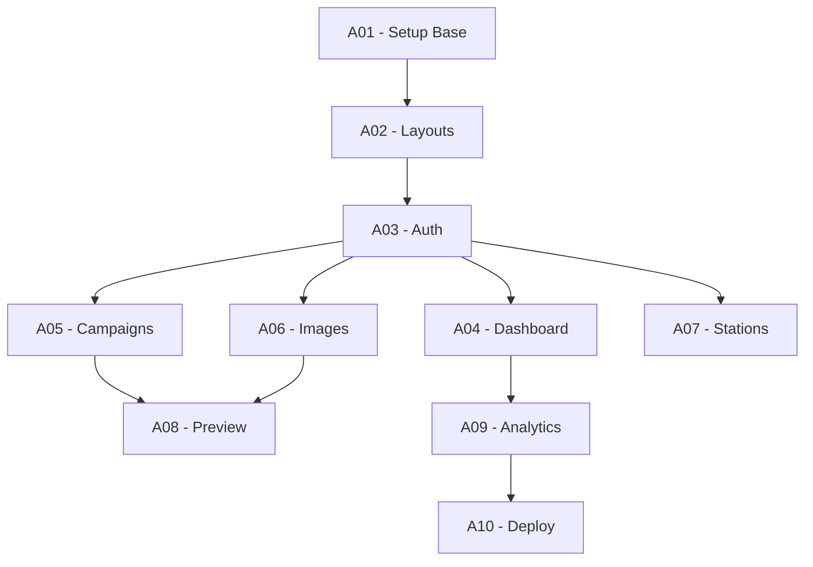

# 🤖 Agentes de Desenvolvimento

Sistema de agentes automatizados para desenvolvimento incremental do portal i9 Smart Campaigns.

## 📂 Estrutura

```
agents/
├── pending/       # Agentes aguardando execução
├── completed/     # Agentes já executados com sucesso
├── continuous/    # Agentes de execução contínua (QA, monitoring)
└── shared/        # Documentação e padrões compartilhados
```

## 🎯 Agentes Disponíveis

### 📋 Pending (Aguardando Execução)

| Agente | Descrição | Dependências |
|--------|-----------|--------------|
| **A01-SETUP-BASE** | Configuração inicial do projeto com Vite + React + TypeScript | Nenhuma |
| **A02-LAYOUTS-COMPONENTS** | Criação de layouts base e instalação de componentes Shadcn/UI | A01 |
| **A03-AUTH-SYSTEM** | Sistema completo de autenticação com JWT | A01, A02 |
| **A04-DASHBOARD** | Dashboard principal com métricas e gráficos | A01, A02, A03 |
| **A05-CAMPAIGNS-CRUD** | CRUD completo de campanhas | A01, A02, A03 |
| **A06-IMAGES-MANAGEMENT** | Sistema de upload e gerenciamento de imagens | A01, A02, A03 |
| **A07-STATIONS-MANAGEMENT** | Gerenciamento e seleção de estações | A01, A02, A03 |
| **A08-PREVIEW-SYSTEM** | Sistema de preview em tempo real | A01, A02, A05, A06 |
| **A09-ANALYTICS** | Analytics com gráficos e relatórios | A01, A02, A03, A04 |
| **A10-SETTINGS-DEPLOY** | Configurações e preparação para deploy | Todos |

### ✅ Completed (Executados)

Agentes movidos para esta pasta após execução bem-sucedida.

### 🔄 Continuous (Execução Contínua)

| Agente | Descrição | Frequência |
|--------|-----------|------------|
| **QA-REVIEW** | Revisão de qualidade e aderência aos padrões | A cada commit/PR |

### 📚 Shared (Recursos Compartilhados)

| Documento | Descrição |
|-----------|-----------|
| **REACT-VITE-STANDARDS.md** | Padrões obrigatórios de desenvolvimento |

## 🚀 Como Executar um Agente

### 1. Leia o Agente
```bash
cat docs/agents/pending/A01-SETUP-BASE.md
```

### 2. Verifique Dependências
- Confirme que agentes anteriores foram executados
- Verifique pré-requisitos listados

### 3. Execute as Tarefas
- Siga as instruções passo a passo
- Execute comandos na ordem especificada
- Valide cada etapa antes de prosseguir

### 4. Valide com Checklist
- Marque cada item do checklist
- Execute testes se aplicável
- Confirme resultado esperado

### 5. Mova para Completed
```bash
mv docs/agents/pending/A01-SETUP-BASE.md docs/agents/completed/
```

## 📊 Fluxo de Execução Recomendado



## ⚠️ Regras Importantes

### SEMPRE:
- ✅ Leia `REACT-VITE-STANDARDS.md` antes de executar qualquer agente
- ✅ Execute agentes na ordem de dependências
- ✅ Valide cada etapa com o checklist
- ✅ Execute QA-REVIEW após cada agente
- ✅ Documente problemas encontrados

### NUNCA:
- ❌ Pule agentes com dependências não resolvidas
- ❌ Modifique agentes durante execução
- ❌ Execute múltiplos agentes simultaneamente
- ❌ Ignore falhas no checklist
- ❌ Crie código fora dos padrões

## 🐛 Troubleshooting

### Agente falhou?
1. Reverta alterações: `git stash` ou `git reset --hard`
2. Verifique logs de erro
3. Confirme dependências instaladas
4. Re-execute desde o início

### Conflito com padrões?
1. Consulte `REACT-VITE-STANDARDS.md`
2. Execute QA-REVIEW para identificar violações
3. Refatore seguindo padrões
4. Re-valide com checklist

### Performance degradada?
1. Execute build: `npm run build`
2. Analise bundle: `npm run analyze`
3. Verifique métricas no checklist
4. Otimize conforme necessário

## 📈 Métricas de Sucesso

Cada agente deve atingir:
- ✅ 100% dos itens do checklist aprovados
- ✅ 0 erros de TypeScript
- ✅ 0 violações de padrões
- ✅ Build < 200KB (gzipped)
- ✅ Todos os testes passando

## 🔄 Ciclo de Melhoria

1. **Execute** o agente seguindo instruções
2. **Valide** com QA-REVIEW
3. **Documente** aprendizados e problemas
4. **Atualize** agente se necessário
5. **Compartilhe** conhecimento com equipe

## 📝 Contribuindo com Agentes

Para criar ou melhorar agentes:

1. Use o template padrão de agente
2. Inclua checklist detalhado
3. Especifique dependências claramente
4. Forneça comandos exatos
5. Adicione seção de troubleshooting
6. Teste em ambiente limpo

## 🎓 Recursos Adicionais

- [Documentação da API](../API-DOCUMENTATION.md)
- [Padrões de Código](shared/REACT-VITE-STANDARDS.md)
- [Instruções para IA](../../CLAUDE.md)
- [README Principal](../../README.md)

---

**Última atualização:** 23/09/2025  
**Versão:** 1.0.0